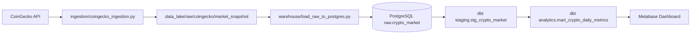

# crypto-data-pipeline

Pipeline de engenharia de dados para mercado de criptomoedas, com fluxo ponta a ponta:

`CoinGecko API -> Ingestao -> Data Lake (raw) -> PostgreSQL (raw) -> dbt (staging/marts) -> Dashboard`

## Objetivo
Construir um projeto realista de portfolio que demonstre as etapas principais de um pipeline moderno de dados:
- coleta de dados externos;
- persistencia em camada raw;
- modelagem analitica com dbt;
- orquestracao com Airflow;
- consumo em dashboard.

## Fluxo do pipeline
### Fluxo funcional
1. O script de ingestao consulta a API da CoinGecko.
2. O payload bruto e salvo no data lake local, particionado por data/hora.
3. O loader le o ultimo arquivo raw e faz upsert em `raw.crypto_market` no PostgreSQL.
4. O dbt transforma `raw` em `staging` e depois em `analytics`.
5. O Metabase consome a tabela analitica para visualizacao.

### Fluxo visual


## Orquestracao (Airflow)
DAG: `crypto_market_pipeline`
- tarefa 1: `ingest_market_snapshot`
- tarefa 2: `load_raw_to_postgres`
- schedule: `0 * * * *` (hora em hora)

A DAG pode ser testada localmente com:
```bash
airflow dags test crypto_market_pipeline 2026-03-31
```

## Camadas de dados
### Raw
Tabela: `raw.crypto_market`
- granularidade: snapshot por ativo e timestamp de ingestao
- chave: `(coin_id, snapshot_at)`
- objetivo: preservar historico bruto para reprocessamento

### Staging
Modelo: `staging.stg_crypto_market`
- padroniza colunas da camada raw
- prepara tipos e campos para analise

### Analytics
Modelo: `analytics.mart_crypto_daily_metrics`
- agrega metricas diarias por ativo
- foco em consumo por BI

## Stack
- Python (ingestao e carga)
- PostgreSQL (warehouse local)
- dbt-postgres (transformacao)
- Apache Airflow (orquestracao)
- Metabase (dashboard)
- Docker Compose (ambiente local)

## Estrutura do repositorio
- `airflow/`: DAGs
- `docker/`: compose e imagem do Airflow
- `ingestion/`: coleta e persistencia raw
- `warehouse/`: DDL e carga para PostgreSQL
- `dbt/`: modelos, testes e macros
- `dashboard/`: consultas iniciais para Metabase
- `docs/`: documentos de arquitetura

## Como executar localmente
### 1) Subir infraestrutura
```bash
docker compose -f docker/docker-compose.yml up -d --build
```

Servicos:
- PostgreSQL: `localhost:5432`
- Airflow: `http://localhost:8080` (`admin` / `admin`)
- Metabase: `http://localhost:3000`

### 2) Rodar ingestao manual
```bash
docker exec crypto_airflow_webserver python /opt/project/ingestion/coingecko_ingestion.py
```

### 3) Carregar no PostgreSQL
```bash
docker exec crypto_airflow_webserver python /opt/project/warehouse/load_raw_to_postgres.py
```

### 4) Transformar com dbt
```bash
docker exec crypto_airflow_webserver bash -lc "cd /opt/project && export DBT_PROFILES_DIR=/opt/project/dbt && dbt run --project-dir dbt"
docker exec crypto_airflow_webserver bash -lc "cd /opt/project && export DBT_PROFILES_DIR=/opt/project/dbt && dbt test --project-dir dbt"
```

### 5) Validar DAG
```bash
docker exec crypto_airflow_webserver airflow dags list
docker exec crypto_airflow_webserver airflow dags test crypto_market_pipeline 2026-03-31
```

## Evidencias de validacao
- ingestao: `50` registros coletados e persistidos no raw local
- carga: `50` registros em `raw.crypto_market`
- dbt: `run` e `test` executados com sucesso
- Airflow: `dags test` concluido com status `success`

## Consultas de verificacao
```sql
SELECT COUNT(*) FROM raw.crypto_market;
SELECT COUNT(*) FROM analytics.mart_crypto_daily_metrics;
```

## Decisoes tecnicas
- comecar com data lake local para reduzir complexidade inicial;
- manter layout de pastas e particionamento prontos para migracao para S3;
- separar claramente ingestao, carga e transformacao para facilitar manutencao.

## Limites atuais
- CI basico implementado (validacoes de sintaxe, compose e dbt parse), sem pipeline de deploy ainda;
- sem deploy em nuvem;
- dashboard com camada inicial (queries base), sem produto visual final publicado.

## Proximos passos
1. Evoluir o CI para incluir testes de integracao com banco efemero.
2. Evoluir data lake para S3 mantendo compatibilidade local.
3. Incluir monitoramento e alertas no Airflow.
4. Publicar dashboard final com KPI de preco, volume e variacao 24h.

## Qualidade e governanca
- License: MIT (`LICENSE`).
- CI pipeline: GitHub Actions (`.github/workflows/ci.yml`) validating Python syntax, Docker Compose config and dbt parse.
- Collaboration guide: `CONTRIBUTING.md` with commit style and PR checklist.


